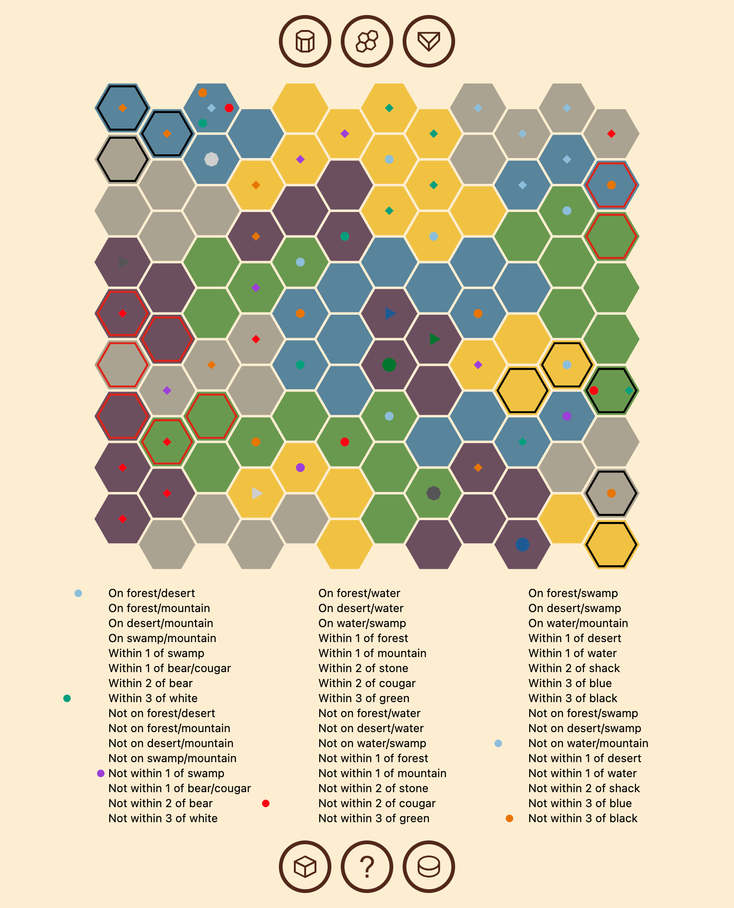

# Decryptid

Decryptid is a simple web app that solves the game of Cryptid for you.




## Run Locally

Clone the project

```bash
  git clone https://github.com/sixthshift/decryptid
```

Go to the project directory

```bash
  cd decryptid
```

Install dependencies

```bash
  yarn install
```

Start the server

```bash
  yarn serve
```


## Run Locally with Docker Dev Container

#### You will need Docker and Docker Compose as a prerequisite

Clone the project

```bash
  git clone https://github.com/sixthshift/decryptid
```

Go to the project directory

```bash
  cd decryptid
```

Spin up the docker Container

```bash
  docker-compose up
```


## Running Tests

To run tests, run the following command

```bash
  yarn test
```


## Tech Stack

React, TailwindCSS


## Authors

- [@sixthshift](https://www.github.com/sixthshift)


## License

[MIT](https://choosealicense.com/licenses/mit/)

